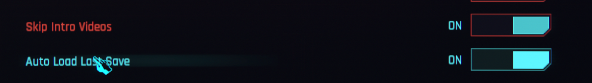

# CP77 Skip Main Menu

## Introduction

>Are you testing your mod? 
>Do you feel like waiting for the game to launch is a waste of your time? 
>Are you tired of clicking "load game" each time you restart your game? 

If so, consider installing this plugin. It will take care of all of those issues for you.

It does so by adding several settings that allow you to skip to the main menu or even load directly into your save.

Preview (Auto Load Last Save is off):

## Settings
The three newly added settings can be found under `Settings->Gameplay->Miscellaneous`.

1. **Auto Load Last Save** 
Enable this option will automatically load into your last save game when you launch the game.

2. **Skip Intro Videos** 
Enable this option will skip all the logo videos and intro videos when launching the game.

3. **Skip Breaching Screen** 
Enable this option will skip the "Breaching" screen where it askes you to press the spacebar to continue.

## Credits
- **Skip Breaching Screen** uses the built-in patch option from Cyber Engine Tweaks.
- Thanks to keanuWheeze's [Native Settings](https://github.com/justarandomguyintheinternet/CP77_nativeSettings), I was able to create the setting widgets without doing much if any research.
